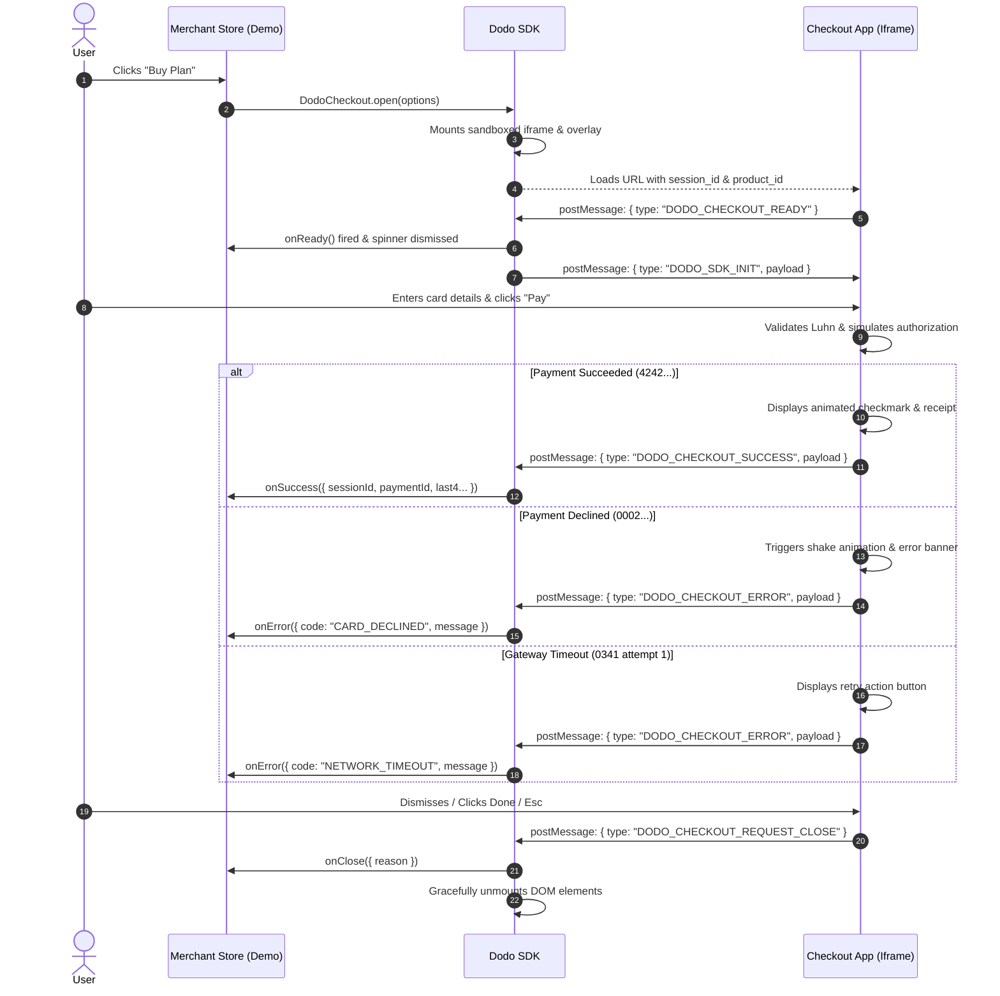

# Dodo Payments — Embeddable Tiny Checkout

> A secure, lightweight, and resilient embeddable checkout designed for merchants to accept payments with minimal friction, zero host CSS contamination, and zero card data leakage.

---

## 🚀 Quick Start

### Prerequisites
- Node.js `>= 18.0.0`
- npm `>= 9.0.0`

### 1. Install Dependencies
```bash
npm install
```

### 2. Start the Local Development Environment
```bash
npm run dev
```

This single command concurrently launches all three packages:
* **Demo Storefront** (Dodo Demo): `http://localhost:5173`
* **Isolated Checkout App**: `http://localhost:5174`
* **SDK Bundle Watcher**: Compiles `@dodo/sdk` to ESM / CJS / IIFE

Visit [http://localhost:5173](http://localhost:5173) in your browser to interact with the demo and observe real-time callback event streams.

---

## 🧪 Testing Test Card Scenarios

The checkout app simulates bank authorization with the required test card matrix:

| Card Number | Expiry | CVC | Expected Behavior |
| :--- | :--- | :--- | :--- |
| `4242 4242 4242 4242` | `12/28` | `123` | **Succeeds** (1.1s realistic processing delay ➔ receipt screen ➔ `onSuccess` callback). |
| `4000 0000 0000 0002` | `12/28` | `123` | **Declines** (Card decline badge with input shake animation ➔ form stays filled ➔ `onError` callback). |
| `4000 0000 0000 0341` | `12/28` | `123` | **Fails once, then succeeds on retry** (Attempt 1: Gateway timeout error with retry button. Attempt 2: Payment confirmed). |

*Note: You can also use the **1-Click Auto Fill** pills located directly inside the checkout form or the Demo Sidebar to test all 3 cards instantly.*

---

## 🏗️ System Architecture & Cross-Boundary Protocol

The solution is divided into three isolated layers:

```
┌─────────────────────────────────────────────────────────────┐
│ 1. Merchant Storefront (Host Page)                          │
│    - Calls DodoCheckout.open({ productId, onSuccess... })   │
│    - Zero access to customer card numbers or CVVs (PCI Scope)│
└──────────────────────────────┬──────────────────────────────┘
                               │ Injects Sandboxed Iframe & Listens
                               ▼
┌─────────────────────────────────────────────────────────────┐
│ 2. Embeddable SDK (@dodo/sdk)                               │
│    - Pure TypeScript, zero external dependencies (<3KB)     │
│    - Origin-verified postMessage router                     │
│    - Timeout watchdog (8s load failure safety net)          │
└──────────────────────────────┬──────────────────────────────┘
                               │ Bidirectional postMessage Protocol
                               ▼
┌─────────────────────────────────────────────────────────────┐
│ 3. Isolated Checkout App (@dodo/checkout)                   │
│    - Hosted on independent origin (e.g. localhost:5174)     │
│    - Luhn validation, brand auto-detection, formatters      │
│    - Resilient state machine with retry-after-fail handling │
└─────────────────────────────────────────────────────────────┘
```

### Typed `postMessage` Communication Flow



---

## Two Decisions I Went Back and Forth On

### 1. Using an `<iframe>` instead of Shadow DOM
At first, I thought about building the checkout popup with Shadow DOM / Web Components because passing data in JavaScript would have been way simpler than dealing with `postMessage`.

I ended up choosing an `<iframe>` for two main reasons:
- **Card Security & PCI Compliance**: If the checkout form is directly on the merchant's webpage, any script on their site (like Google Analytics, Facebook Pixel, or browser extensions) could potentially read the card inputs. Putting the checkout inside a separate domain iframe completely blocks the merchant site from seeing card numbers or CVV.
- **CSS Conflicts**: Websites have all kinds of wild CSS resets (like `* { box-sizing: content-box !important; }`) that often leak into Shadow DOM and mess up button alignments. An iframe guarantees the checkout form looks clean and identical on every website.

---

### 2. How the Modal Opens & Loads
I had to figure out how to handle the loading experience when a user clicks "Buy":
- If I showed the iframe immediately, people on slower internet would see an ugly blank white box pop up while the page loaded.
- If I waited until the iframe finished loading before showing anything at all, the "Buy" button felt laggy and unresponsive when clicked.

To fix this, I made the background overlay and a small spinner show up immediately when the user clicks the button so they know it's working. The checkout form stays hidden until it finishes loading and sends a quick message saying it's ready, then it smoothly appears. I also added an 8-second timeout so that if the user is offline or the server fails, the popup automatically closes and returns an error instead of getting stuck forever.

---

## What I'd Build Next
1. **3D Secure (OTP / Bank Authentication)**: Adding an extra verification screen for credit cards that require an SMS OTP or bank app confirmation.
2. **Apple Pay & Google Pay**: Adding native one-click buttons using the browser's Payment Request API.
3. **Signed Backend Sessions (JWT)**: Instead of passing product amounts in frontend code, have the merchant's backend create a secure session key to prevent users from tampering with prices in DevTools.
